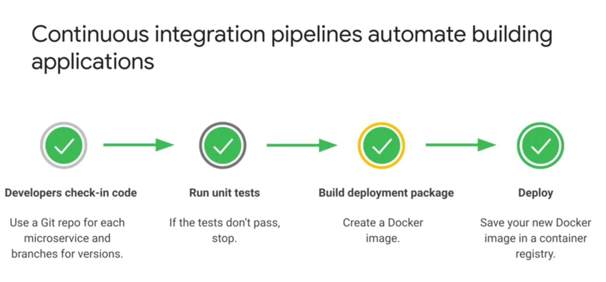
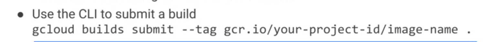

# Pipelines de integração contínua

Os pipelines de integração contínua automatizam a compilação de aplicativos. 
O gráfico abaixo é uma representação simplista de um pipeline, que pode ser personalizado para atender aos seus requisitos. 

O processo começa com o check-in do código em um repositório onde os testes de unidade serão executados. Se os testes forem aprovados, um pacote de implantação será criado como uma imagem do Docker. Essa imagem é salva em um Container Registry para ser implantada.Cada microsserviço deve ter o próprio repositório. As etapas adicionais comuns incluem inspeção do código, análise de qualidade usando ferramentas, como o SonarQube, testes de integração, geração de relatórios de testes e verificação de imagem. 

O GCP tem os componentes necessários para criar um pipeline de integração contínua, alguns deles são: 

## Cloud Source Repositories 

O **Cloud Source Repositories (CSR)** oferece repositórios Git privados, gerenciados e que estão hospedados no Google Cloud. Esses repositórios permitem desenvolver e implantar um app ou serviço em um espaço que oferece colaboração e controle de versões do código. 

É possível usar o Cloud IAM para adicionar membros da equipe ao projeto e conceder a eles permissões para criar, visualizar e atualizar repositórios.

Outro ponto importante é poder configurar os repositórios para publicar mensagens em um tópico especificado do Pub/Sub, por exemplo. Mensagens podem ser publicadas, dentre outras coisas, quando um usuário cria ou exclui um repositório. 

O CSR também tem outros recursos, como debug em produção usando o Cloud Debugger, geração de logs sobre quando, onde e quais ações foram realizadas, e implantação direta no App Engine. Também é possível conectar um repositório GitHub ou Bitbucket.

## **Cloud Build**

O **Cloud Build** pode importar o código-fonte do Cloud Storage, Cloud Source Repositories, GitHub ou Bitbucket, executar um build de acordo com as especificações e produzir artefatos, como contêineres do Docker ou arquivos Java. 

O Cloud Build executa o build como uma série de etapas de compilação. Cada uma delas ocorre em um contêiner do Docke, permitindo as mesmas ações realizadas em um contêiner, em qualquer que seja o ambiente. É possível manter as etapas padrão ou definir outras.

Um trigger do Cloud Build inicia uma compilação automaticamente quando o código-fonte é alterado. Você pode configurar o trigger para compilar o código quando alguma alteração for feita no repositório de origem ou só nas mudanças que corresponderem a critérios específicos.
O Cloud Build também permite criar software rapidamente em todas as linguagens. 

A CLI pode ser usada para enviar um build com o `gcloud`. Veja um exemplo na imagem abaixo: 

O comando `gcloud builds submits --tag gcr.io/project-id/image-name .` , inicia o build, que será executado. A `--tag` indica a tag usada na criação da imagem. É preciso ter o namespace, que neste caso é o `gcr.io/`, seguido pelo id do seu projeto e, por fim, o ponto `.` representa o local da origem que será compilada.

Os trigger de compilação monitoram um repositório e criam um contêiner sempre que um código é enviado. Os trigger do Google podem ser usados com Maven, Cloud Build e Docker. 

É possível definir uma expressão regular para uma ramificação ou um valor de tag. E a configuração do build também pode ser definida em um Dockerfile ou arquivo do Cloud Build. 

 

## **O Container Registry** 

**O Container Registry** é um local para a equipe gerenciar imagens do Docker ou pacotes de implantação, fazer análises de vulnerabilidade e definir quem acessará quais componentes com controle de acesso avançado. Especificamente o `Container Registry` é um repositório do Docker hospedado pelo GCloud. As imagens criadas com o Cloud Build são salvas automaticamente no Container Registry. 

Também é possível enviar e baixar imagens usando os comandos padrão do Docker como, por exemplo, `docker push` para enviar e `docker pull` para baixar.

Com a autorização binária, apenas contêineres confiáveis podem ser implantados no GKE. A autorização binária é um serviço do Google Cloud baseado na especificação do Kritis Signer. Para que o serviço funcione, é necessário ativar a autorização binária no cluster do GKE onde a implantação será feita. É necessária uma política para assinar as imagens. Quando uma imagem é criada pelo Cloud Build, um atestador verifica que ela veio de um repositório confiável, como o Source Repositories por exeplo. 

O Container Registry inclui uma verificação de vulnerabilidades que analisa os contêineres. O diagrama mostra um fluxo de trabalho comum. A inclusão de código aciona o gatilho de compilação do Cloud Build. Como parte da compilação, o Container Registry vai fazer uma verificação de vulnerabilidades assim que uma nova imagem for adicionada por upload. O mecanismo de verificação publica mensagens no Pub/Sub. O Kritis Signer detecta notificações do Pub/Sub do mecanismo de verificação de vulnerabilidades do Container Registry e gera um atestado se a imagem for aprovada na verificação. Depois o serviço de autorização binária do Google Cloud aplica a política que exige os atestados do Kritis Signer para implantar uma imagem de contêiner. Esse fluxo impede a implantação de imagens com vulnerabilidades abaixo de um limite determinado.