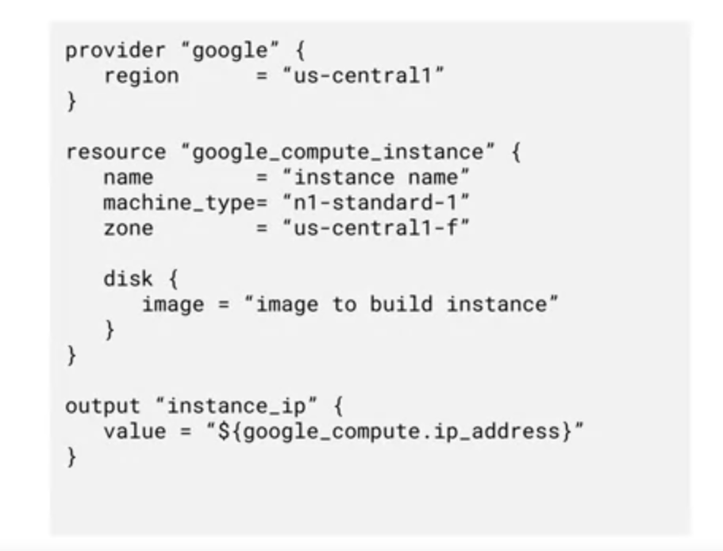

# Infraestrutura como código

## Conceito
A migração para a nuvem requer uma mudança de mentalidade. O modelo de computação em nuvem sob demanda e com pagamento baseado no uso é diferente do modelo de infraestrutura de provisionamento local. Um modelo local típico inclui a compra de máquinas, que são mantidas em operação continuamente. A infraestrutura de computação é formada por poucas máquinas com maior capacidade. Do ponto de vista financeiro, as máquinas são um investimento que perde valor ao longo do tempo. Na nuvem, os recursos são alugados em vez de comprados. Portanto, as máquinas são desligadas quando não estão mais em uso para reduzir os custos. A abordagem típica é ter várias máquinas com menor capacidade, adicionando mais recursos quando necessário, e se preparar para possíveis falhas. Do ponto de vista financeiro, as máquinas são uma despesa mensal. Todos os componentes da infraestrutura na nuvem devem ser descartáveis. 

Por isso, utiliza-se a infraestrutura como código (IaC) para provisionar, configurar e implantar as operações que serão automatizadas. A automatização dos processos minimiza riscos, elimina erros causados pela interação manual, suporta implantações repetíveis, facilita o escalonamento e agiliza as operações. Implantar uma ou cem máquinas exige o mesmo esforço. A automação pode ser feita com scripts ou ferramentas declarativas, como o Terraform, por exemplo. É muito importante não perder tempo tentando consertar máquinas com problemas nem instalando patches ou upgrades, porque isso pode gerar problemas ao recriar os ambientes no futuro. Se uma máquina apresentar problemas, basta remover e criar outra. É possível reduzir os custos com ambientes temporários, como os de testes que são uma réplica do ambiente de produção.

Dessa forma, a infraestrutura como código permite provisionar e remover infraestruturas rapidamente. O provisionamento sob demanda de uma implantação é extremamente avançado. É possível incorporar esse recurso a um pipeline de integração contínua que facilita a trajetória rumo à implantação contínua. O provisionamento automatizado de infraestrutura indica que ela pode ser provisionada sob demanda e que a complexidade de implantação é gerenciada no código. Isso oferece a flexibilidade para alterar a infraestrutura de acordo com as mudanças nos requisitos. Todas as alterações ficam em um só local. A infraestrutura de ambientes, como de desenvolvimento e teste, agora pode replicar facilmente o ambiente de produção e ser excluída de imediato quando não estiver em uso. 

## Terraform

Muitas ferramentas podem ser utilizadas para implementação do IaC, neste modulo, o foco vai ser o Terraform, uma ferramenta de código aberto que permite provisionar os recursos do Google Cloud, como máquinas virtuais, contêineres, armazenamento e rede, com arquivos de configuração declarativos. Basta você especificar todos os recursos necessários ao seu aplicativo em um formato declarativo e implantar sua configuração. 

A linguagem de configuração HashiCorp (HCL) permite descrições resumidas de recursos usando blocos, argumentos e expressões. É possível repetir essa implantação várias vezes com resultados consistentes e excluir uma implantação inteira com um comando ou clique.

O benefício de uma abordagem declarativa é possibilitar que você especifique a configuração e permitir que o sistema identifique as etapas que serão realizadas. Em vez de implantar cada recurso separadamente, você especifica o conjunto de recursos que será incluído no aplicativo ou serviço, assim você se dedica ao aplicativo. Ao contrário do Cloud Shell, o Terraform implanta recursos em paralelo. O Terraform usa as APIs subjacentes de cada serviço do Google Cloud para implantar seus recursos. Isso permite implantar quase tudo o que vimos até agora, de instâncias, modelos de instância e grupos a redes VPC, regras de firewall, túneis VPN, Cloud Routers e balanceadores de carga.  

A linguagem do Terraform é a interface do usuário para declarar os recursos. Os recursos são os objetos da infraestrutura, como Compute Engine, armazenamento, contêineres etc. Uma configuração do Terraform é um documento completo na linguagem do Terraform que o instrui a gerenciar determinada coleção de infraestruturas. Uma configuração pode incluir vários arquivos e diretórios. A sintaxe da linguagem do Terraform inclui blocos que representam objetos e podem ter zero ou mais identificadores, e também é possível criar blocos aninhados. Os argumentos são usados para atribuir um valor a um nome e expressões, que são usadas para atribuir valores a vários identificadores. É possível usar o Terraform em várias nuvens públicas e privadas. 

O Terraform já vem instalado no Cloud Shell. O arquivo de configuração de exemplo mostrado abaixo começa indicando o Google Cloud como provedor. Em seguida, ele define a configuração de uma instância do Compute Engine e do disco dela. A seção de saída permite ver os endereços IP da instância provisionada para a implantação.

Importante ressaltar que além do Terraform, o Google Cloud também oferece suporte para outras ferramentas de IaC, como Chef, Puppet e Ansible, por exemplo.