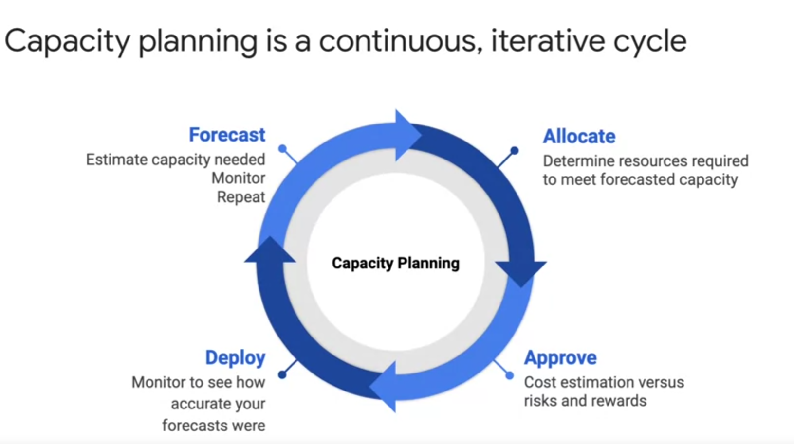

# Planejamento de custos

O planejamento de custos é uma fase importante do design. Ele começa com o planejamento da capacidade. Eu recomendo que você trate o planejamento de capacidade não como uma tarefa única, mas como um ciclo interativo contínuo. 

Comece com uma previsão que estime a capacidade necessária, monitore e avalie essa previsão e, em seguida, faça a alocação determinando os recursos necessários para atender à capacidade prevista. Assim você pode estimar os custos e dosar os riscos e recompensas.Após a aprovação do design e do custo, implante um design e o monitore para ver a acurácia das previsões. Isso vale para a próxima previsão, à medida que o processo se repete.

Um bom ponto de partida para quem trabalha com otimização de custos é conhecer os preços das instâncias de VM. Geralmente, é útil começar com algumas máquinas pequenas capazes de escalonar horizontalmente, de forma automática, conforme a demanda cresça. Para otimizar o custo das máquinas virtuais, considere utilizar descontos por compromisso de uso, eles podem ser significativos. Se as cargas de trabalho permitem instâncias preemptivas, você pode economizar até 80% e usar a recuperação automática quando as instâncias tiverem preempção.

O Compute Engine também oferece recomendações de tamanho para as instâncias de VM. Esse é um recurso muito útil que pode ajudar você a escolher o tamanho certo de VM para suas cargas de trabalho e otimizar custos.

Um erro comum é alocar muito espaço em disco. Isso não é econômico, mas a escolha de um disco requer considerações que vão além do tamanho. É importante determinar as características de desempenho exibidas pelos aplicativos; os padrões de E/S; leituras grandes ou gravações pequenas, ou o contrário; e dados principalmente de somente leitura. Esse tipo de informação ajuda você a selecionar o tipo certo de disco. Entender os padrões de E/S pode levar a uma economia significativa.

Para otimizar os custos de rede, uma prática recomendada é manter as máquinas o mais próximo possível dos dados que elas precisam acessar. Também é importante conhecer as cobranças de saída. Elas não são tão simples. A saída na mesma zona é gratuita. A saída para um serviço de nuvem diferente na mesma região, usando um endereço IP externo ou interno, também é gratuita, exceto para alguns serviços como o Memorystore para Redis. A saída entre zonas na mesma região é cobrada, assim como toda saída da Internet. Uma forma de otimizar os custos de rede é manter as máquinas próximas aos dados.

Outra forma de fazer isso é utilizar a medição de uso do GKE, que evita provisionar demais o cluster do Kubernetes. Com a medição de uso do GKE, um agente coleta as métricas de consumo, além das solicitações de recurso, inquirindo os objetos de métrica do pod no servidor da métrica. O registro de solicitações do recurso e os registros de consumo do recurso são exportados para duas tabelas separadas, que você especifica, nos conjuntos de dados do BigQuery. Comparar a solicitação e os recursos consumidos facilita a identificação de desperdício e a tomada de medidas corretivas.

Anteriormente no curso, falamos sobre os diversos serviços de armazenamento. É importante comparar os custos das diferentes opções, além das características delas. Por exemplo, no momento desta gravação, o Firestore oferece 1 GB de armazenamento sem custos no nível de acesso gratuito. Ao armazenar a mesma quantidade de dados no Cloud Bigtable, você poderia pagar mais de U$S 1.000 por mês, visto que precisaria de ao menos três nós do Bigtable. Ou seja, o serviço de armazenamento e banco de dados que você escolher pode fazer grande diferença na fatura.

O design de arquitetura também pode ajudar você a otimizar custos. Por exemplo, ao usar o Cloud CDN para conteúdo estático ou o Memorystore como cache, você economiza em vez de alocar mais recursos. De modo semelhante, em vez de usar um repositório de dados entre dois aplicativos, considere utilizar mensagens e filas com o Pub/Sub para dissociar os serviços de comunicação e reduzir as necessidades de armazenamento.

A calculadora de preços é um recurso essencial para estimar custos. As estimativas precisam usar como base as previsões e o planejamento de capacidade. Essa ferramenta é ótima para comparar os custos de vários serviços de computação e armazenamento. Você vai usá-la na próxima atividade de design.

Para monitorar os custos do serviço atual, use esta página de relatórios do Cloud Billing. Este relatório mostra as alterações no custo em comparação ao mês anterior. Você pode usar filtros para pesquisar determinados projetos, produtos e regiões. As recomendações de tamanho para as instâncias do Compute Engine também vão estar no relatório.

Para uma análise avançada de custos, recomendo a exportação dos dados de faturamento para o BigQuery, é possível analisá-los para identificar grandes despesas e otimizar os gastos com o Google Cloud. Por exemplo, digamos que você vá etiquetar suas instâncias de VM espalhadas em várias regiões. Talvez elas enviem a maior parte do tráfego para outro continente, o que pode gerar custos maiores. Nesse caso, considere reposicionar algumas delas ou usar um serviço como o Cloud CDN para armazenar o conteúdo em cache mais próximo aos usuários, reduzindo o gasto com rede. É possível até mesmo visualizar o gasto ao longo do tempo com o Google Data Studio. Ele transforma os dados em painéis e relatórios informativos fáceis de ler e compartilhar e totalmente personalizáveis. Os dados do serviço têm visualização diária e mensal, oferecendo resumos de visão geral que também podem ser detalhados, gerando mais insights.

Para ajudar a planejar o projeto e controlar os custos, defina um orçamento. Dessa forma, é possível acompanhar o crescimento dos gastos quanto ao valor.Primeiro defina um nome para o orçamento e especifique a qual projeto ele vai ser aplicado. Depois informe um valor específico ou use o gasto do mês anterior como base. Por fim, configure os alertas de orçamento. Assim os administradores de faturamento recebem e-mails quando o gasto excede um percentual do orçamento ou o valor especificado. Neste caso, o e-mail vai ser enviado caso o gasto chegue a 50%, 90% e 100% do valor do orçamento. Você pode optar por enviar um alerta quando a previsão for que o gasto vai exceder um percentual do valor do orçamento ao fim do período do orçamento. Além de receber um e-mail, você pode usar notificações do Pub/Sub para receber programaticamente atualizações sobre o orçamento. É possível até criar uma função do Cloud que atenda ao tópico do Pub/Sub para automatizar o gerenciamento de custos.